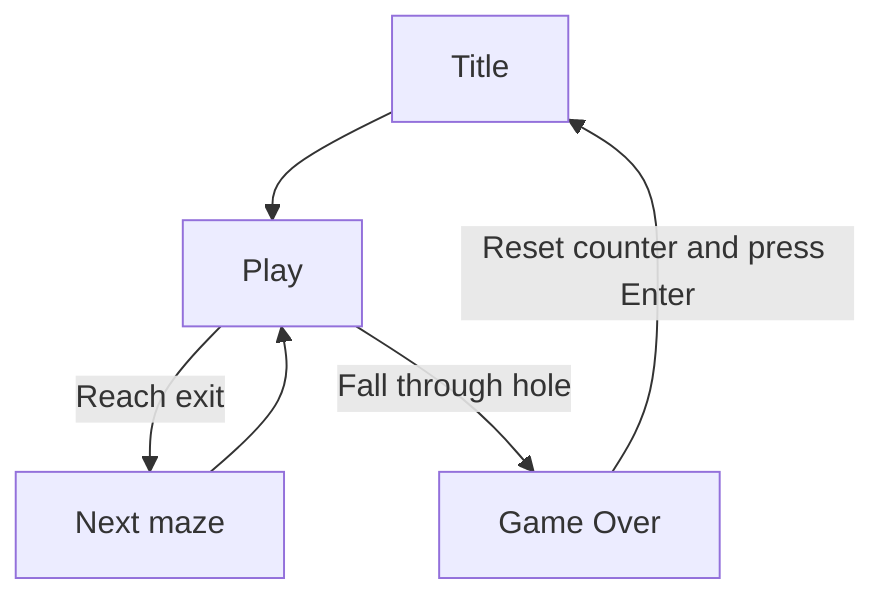

# 👻 Dreadhalls — Falls in the Halls Update

[](https://learn.microsoft.com/en-us/dotnet/csharp/)
[](https://unity.com/)

Welcome to my implementation of **Dreadhalls** for Harvard University's *CS50's Introduction to Game Development*. This project extends the first-person maze game from Lecture 9 by adding dangerous holes, a separate Game Over scene and a maze counter that tracks the player's progress.

- To watch my demo, click the link: [Demo Video]()

---

## 🚀 Project Overview

The objective of this assignment was to work with Unity's procedural level generation, scene system and persistent game state. Each generated maze contains a small number of missing floor sections. Falling through one of these holes ends the current run, resets the maze counter and sends the player to a dedicated Game Over scene.

## 🎮 Features Implemented

- **Procedurally Generated Floor Holes:** Each maze contains approximately three or four missing floor sections, depending on its size.
- **Controlled Hole Placement:** Holes are introduced while the maze blocks are instantiated without changing the underlying maze data.
- **Fall Detection:** The player's vertical position is monitored to determine when they have fallen below the playable maze.
- **Separate Game Over Scene:** Falling through a hole loads a dedicated scene with its own Game Over message and instructions.
- **Return to Title:** Pressing `Enter` in the Game Over scene returns the player to the Title scene.
- **Maze Progress Counter:** A Text label in the Play scene displays the current maze number.
- **Persistent Progression:** The maze count increases whenever the player advances to the next generated maze.
- **Game Over Reset:** The static maze counter is reset to `0` when a run ends.
- **Audio Clean-Up:** The persistent `WhisperSource` object is destroyed during the Game Over transition so that Play and Title music do not overlap.

---

## 🕹️ Controls

| Input | Game Action |
| :--- | :--- |
| Controls configured by the Lecture 9 project | **Move and look around the maze** |
| `Enter` / `Return` | **Start from the Title scene or return to the Title scene after Game Over** |

---

## 🛠️ Built With

- **Language:** C#
- **Engine:** Unity (3D)
- **User Interface:** Unity UI Text components
- **Scene Management:** Unity SceneManager
- **Level Design:** Procedural maze and GameObject generation

---

## 🧠 Core Concepts Explored

- **Procedural Level Generation:** Maze geometry is created at runtime by instantiating configured block prefabs.
- **Selective Object Spawning:** A limited number of floor blocks are skipped to create holes without filling the maze with unavoidable hazards.
- **Transform-Based Fall Detection:** The player's Y-axis position is checked against a minimum height threshold.
- **Scene Management:** Unity scenes separate the Title, Play and Game Over states.
- **MonoBehaviour Lifecycle:** Gameplay scripts use Unity update methods to monitor the player and react to input.
- **Static Game State:** A shared counter persists between maze reloads and is explicitly reset after Game Over.
- **UI State Synchronisation:** The Play scene's Text label is updated to reflect the current maze number.
- **Persistent Audio Management:** A `DontDestroyOnLoad` audio object is removed at the correct transition to prevent overlapping music.

---

## 💻 Code Architecture

| Script / Scene | Responsibility |
| :--- | :--- |
| `LevelGenerator.cs` | Generates the maze geometry and omits a limited number of floor blocks to create holes. |
| Fall-detection MonoBehaviour | Monitors the player's Y position, resets progress and loads the Game Over scene after a fall. |
| Static maze counter | Stores the current maze number across Play scene reloads. |
| Play scene Text label | Displays the current maze and refreshes when progression occurs. |
| `Game Over` scene | Displays the end-of-run message and returns to the Title scene when `Enter` is pressed. |
| `Title` scene | Provides the starting screen for a new run. |
| `WhisperSource` | Holds the persistent Play-scene audio and is destroyed before returning to the Title flow. |

### Fall Detection and Scene Transition

The following C# example illustrates the required fall-detection flow. The exact threshold and progress-field location depend on the project's scene configuration:

```csharp
using UnityEngine;
using UnityEngine.SceneManagement;

public class DespawnOnHeight : MonoBehaviour
{
    [SerializeField] private float minimumHeight = -2f;

    private void Update()
    {
        if (transform.position.y >= minimumHeight)
        {
            return;
        }

        MazeProgress.CurrentMaze = 0;

        GameObject whisperSource = GameObject.Find("WhisperSource");
        if (whisperSource != null)
        {
            Destroy(whisperSource);
        }

        SceneManager.LoadScene("Game Over");
    }
}
```

This keeps the fall check attached to the player, resets progression before the scene changes and removes the persistent audio source before Title music can begin again.

---

## 🔁 Game Flow



---

## 🚀 How to Run the Game

### Prerequisites

- Install **Unity 2018.4.28f1**, the version recommended for the archived project.
- Make sure the Title, Play and Game Over scenes are included in the project's Build Settings.

### Running in Unity

1. Clone or download the project repository.
2. Open **Unity Hub**.
3. Select **Add** or **Open**, then choose the `dreadhalls` project folder.
4. Open the Title scene.
5. Press the **Play** button in the Unity Editor.

---

## 📚 Course Assignment

This project is based on the archived CS50 Games Dreadhalls assignment from Lecture 9. The assessed extension required:

- Three or four floor holes per maze.
- A separate Game Over scene triggered when the player falls.
- An `Enter` action that returns from Game Over to the Title scene.
- A Play-scene Text label showing the current maze number.
- Maze progression that persists between levels and resets to `0` after Game Over.
- Correct removal of `WhisperSource` to prevent overlapping music after scene transitions.

[CS50's Introduction to Game Development](https://cs50.harvard.edu/games/)
